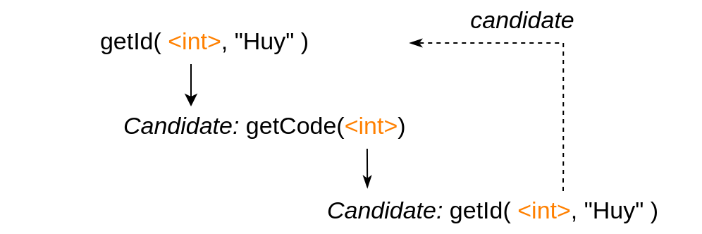
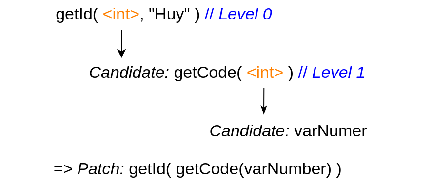

# AtomRepair

An Automated Program Repair Method Using Atomic Replacement for Java Programs

## I. Requirement
- Java 1.8
- GZoltar 0.1.1
- [Defects4J](https://github.com/rjust/defects4j)
## II.Run AtomRepair
1. Clone and run [Defects4J](https://github.com/rjust/defects4j)
2. Clone AtomRepair
```
git clone https://github.com/huyenhuyen1204/AtomRepair.git
```
3. Compile project
```
sh compile.sh
```
4. Edit config in "run.sh"
```
#!/bin/bash
bug=<bug_ID>
d4jPath=<path_to_defects4j>
df4jData=<path_of_containing_defects4J_bugs>
level=<level>

java -Xmx4g -cp "target/classes:target/dependency/*" main.Runner $bug $df4jData $df4jPath $level
```
Example:
```
#!/bin/bash
bug=Chart_1
df4jPath=/home/huyenhuyen/Desktop/APR/defects4j/
df4jData=/home/huyenhuyen/APR/projects/
level=1

java -Xmx4g -cp "target/classes:target/dependency/*" main.Runner $bug $df4jData $df4jPath $level
```
5. Run
```
sh run.sh
```

Note: 
- You can use IntelliJ IDE and run src/main/java/main/Runner.java with four parameters respectively $bug $df4jData $df4jPath $level
- We recommend using level=1 to solve infinite loop. our knowledge, in practical projects, the most common case is where a function has a function parameter (i.e., LEVEL = 1)

The below figure is a scenario of an infinite loop when the candidate of a token is a method with a parameter.

[](imgs/slide-loop1.drawio.png)

To solve the infinite loop, we limit level = 1 shown below figure:

[](imgs/fix.png)


